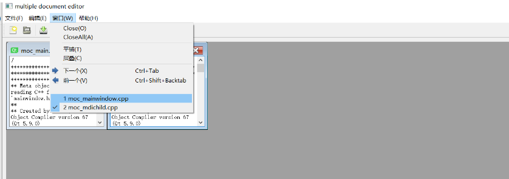

# QSignalMapper 

用于做信号的映射器。对于一个窗体的多个相同部件，发射某个无参数信号。映射为携带该部件特定参数的信号。 

在多文档编辑器应用中用于实现子窗口列表功能的代码是一个很好的体现。

```cpp
//初始化一个windowMapper
windowMapper = new QSignalMapper(this);
//mapper 信号绑定到 更新子窗口槽 
connect(windowMapper, SIGNAL(mapped(QWidget*)), this, SLOT(setActiveSubWindow(QWidget *)));


//添加新的action 到菜单栏 ，text即为文件名
for(int i = 0; i < allSubWindows.size(); i++)
{

    text = ... // action name   

    QAction *action = ui->menuW->addAction(text);  
    action->setCheckable(true);     
    //set current active window is checked status 
    action->setChecked(child == activeMdiChild());
    //when action triggered , windowMapper will emit map signal with current widget argument 
    connect(action, SIGNAL(triggered()), windowMapper, SLOT(map()));
    windowMapper->setMapping(action, windows.at(i));

}
```



如上图，窗口菜单栏下的文件列表。每个文件对应一个`Action`。 这些 `Action` 在点击后，应该能实现窗口的切换。`action` 点击后会触发信号 `triggered()` 但并不能携带任何参数，也就是说不能直接告诉 `setActiveSubWindow` 槽，去激活哪个窗口。这个时候用 `windowMapper` ，可以实现将 `triggered()` 信号绑定到 `map()` ，由`map()` 信号，来将窗体参数发送至 `setActiveSubWindow` 槽。 

