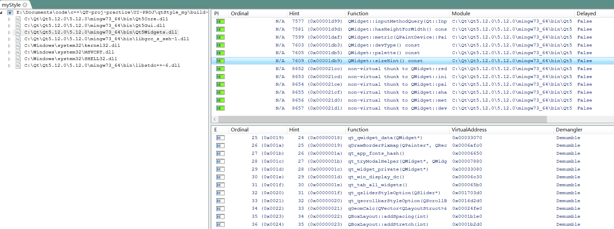

# QT windows 部署 

## 步骤 

1. 编译`Release` 版本程序 
2. 安装 `Dependencies` 工具在PC上，可查看目标程序的依赖库 
[installDenpendencies](https://github.com/lucasg/Dependenciesa)

3. 用 `windeployqt` 工具，可将`exe`需要的`DLL`文件，复制到指定目录下 

4. 打包库文件和可执行程序以及其他相关文件到压缩包 
5. 移动到目标机器上去，解压缩，并执行 

