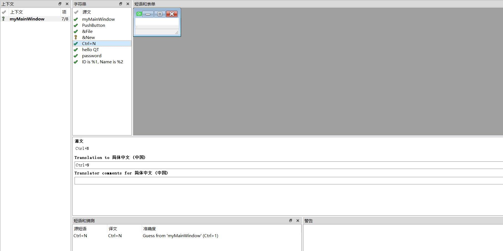

# QT 国际化 

## Instruction 

就是指 使应用程序可以让其他国家的用户使用的过程。 

## 使用 QT linguist 翻译应用程序


1. 先写应用程序。在应用程序窗体的构造类中，会提到某些字符串 

2. 运行 lupdate 工具，从c++源代码中提取要翻译的文本 ，这时会生成一个.ts 文件，这个文件是XML格式的。 

3. 在QT Liguist 中打开.ts 文件，并完成翻译工作 



4. 运行 lrelease 工具，从.ts 文件中获得.qm 文件，它是一个二进制文件,通过在`main.cpp`的`main` 函数，加入以下代码，来加载翻译后的字符串 

```c++ 
QTranslator translator;
translator.load("../myI18N/myI18N_zh_CN.qm");
a.installTranslator(&translator);


```