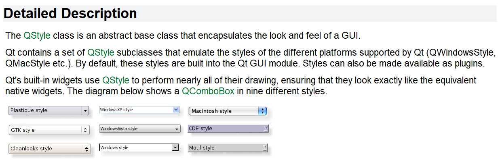
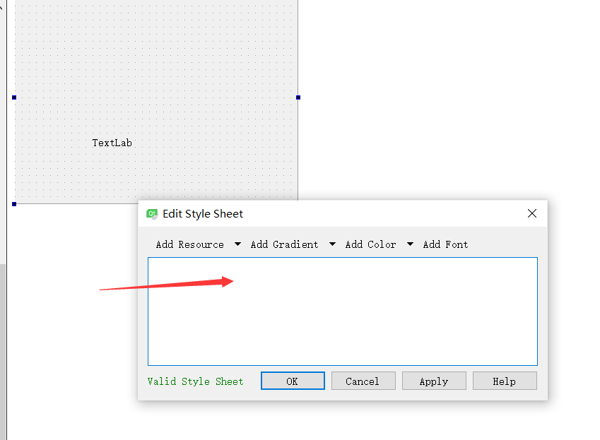

# QT 风格和样式表 

## QT style 

```c++ 
[static] void QApplication::setStyle(QStyle *style)
void QWidget::setStyle(QStyle *style)
```

using above funcitons can set the style of widget or control.
The flowing pictures show the `combox` effect of some styles




## QT Style sheet 

### Instruction 

It's a powerful mechanism for customizing the appearance of parts

### How to use it 

1. Use the code  

```c++
//setting button style sheet 
ui->pushButton->setStyleSheet("background:yellow");

//setting style sheet of main window 
setStyle("QPushButton{background:yellow}QSlider{background:blue});
```


2. set style sheet on `designer` 




You can add these lines to the `text box`
```
QPushButton{
    background-color: rgb(0, 85, 255);
}
SLIDER{
    background-color:rgb(83, 255, 94);
}

```
## QT style sheet syntax 


1. 样式规则
2. 选择器类型
3. 子控件 
4. 伪状态
5. 冲突解决
6. 层叠
7. 继承 

参考 qt 帮助文档 


